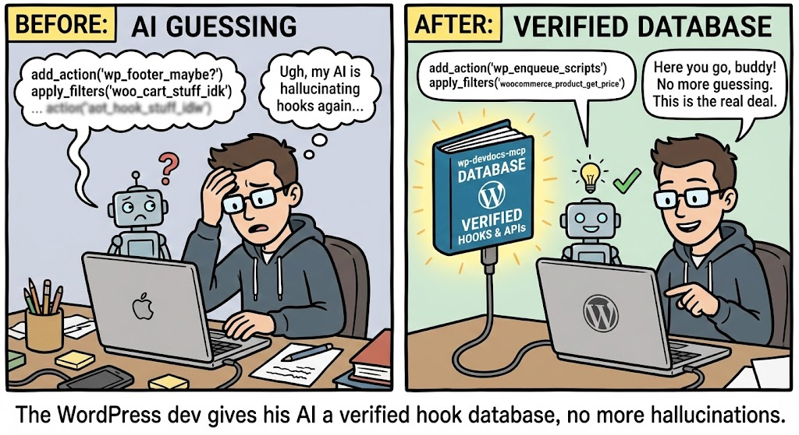

# wp-devdocs-mcp

<p align="center">
  
</p>

**Give your AI coding assistant a verified WordPress hook database instead of letting it guess.**

wp-devdocs-mcp is a local [MCP server](https://modelcontextprotocol.io/) that indexes every action, filter, block registration, and JS API call from WordPress, WooCommerce, Gutenberg, or any plugin you work with. It gives AI tools like Claude Code a verified database to search and validate against instead of relying on training data.

## Why This Exists

AI coding assistants are changing how we build WordPress plugins. Tools like Claude Code, Cursor, and Windsurf can scaffold entire plugins in minutes — but they all share the same blind spot: **hook names come from training data, not from the actual source code**.

Most of the time this works fine. Models like Claude Sonnet nail common hooks almost every time. But "most of the time" isn't good enough when you're shipping production code, and not every model is Claude Sonnet. Across the landscape of LLMs doing code generation today:

- **Some models invent hooks that don't exist** — `woocommerce_email_after_order_details` sounds right but isn't real
- **Some use deprecated namespaces** — `wp.editor.InspectorControls` instead of `wp.blockEditor.InspectorControls`
- **Most miss newer hooks** — suggesting `pre_get_posts` for WooCommerce order queries when HPOS uses `woocommerce_order_list_table_prepare_items_query_args`
- **Parameters get mixed up** — wrong argument count or order in callback signatures
- **No model knows your custom plugins** — private or proprietary hooks are invisible to every model's training data

The core issue is simple: we can't rely 100% on any model to produce correct WordPress hook names from memory alone. Even the best models benefit from verification, and the rest genuinely need it. You only find out about hallucinated hooks when the code doesn't work — and in an agentic workflow where the AI writes, tests, and iterates autonomously, one bad hook name can send it down a rabbit hole of debugging something that was never going to work.

## The Solution

**Feed the LLM real data.** Instead of hoping the model remembers the right hook name, give it a verified database to query.

wp-devdocs-mcp parses the actual source code of any WordPress plugin and builds a searchable index of every hook with its exact name, type, parameters, file location, and surrounding code context. Your AI assistant queries this index before writing code — so every hook name in the generated code is verified against the real source.

This fits naturally into agentic coding workflows. When Claude Code (or any MCP-compatible assistant) needs to use a WordPress hook, it:

1. **Searches** the indexed database for relevant hooks
2. **Validates** the exact hook name exists before writing it into code
3. **Reads the context** — parameters, docblock, surrounding code — to use it correctly

No hallucination. No guessing. No debugging phantom hooks.

**What gets indexed:**

| Type | Examples |
|------|---------|
| PHP actions | `do_action()`, `do_action_ref_array()` |
| PHP filters | `apply_filters()`, `apply_filters_ref_array()` |
| JS hooks | `addAction()`, `addFilter()`, `applyFilters()`, `doAction()` |
| Block registrations | `registerBlockType()`, `registerBlockVariation()` |
| JS API usages | `wp.blocks.*`, `wp.blockEditor.*`, `wp.data.*`, etc. |

**What the AI gets for each hook:**

- Exact name (with dynamic name detection for hooks like `woocommerce_thankyou_{$payment_method}`)
- Type (action / filter / js_action / js_filter)
- Parameters and count
- File path and line number
- Enclosing function and class
- Docblock
- Code window (8 lines before, 4 after)
- Source plugin name

## Quick Start

```bash
# Clone and install
git clone https://github.com/pluginslab/wp-devdocs-mcp.git
cd wp-devdocs-mcp
npm install
```

### Index Your First Source

Each `source:add` command clones the repo and indexes it automatically:

```bash
# WooCommerce (uses trunk branch)
npx wp-hooks source:add \
  --name woocommerce \
  --type github-public \
  --repo https://github.com/woocommerce/woocommerce \
  --subfolder plugins/woocommerce \
  --branch trunk
```

That's it. 3,500+ hooks indexed in under a minute.

### Connect to Claude Code

Add the MCP server to your Claude Code configuration. Create or edit `.mcp.json` in your project root:

```json
{
  "mcpServers": {
    "wp-devdocs": {
      "command": "npx",
      "args": ["--prefix", "/absolute/path/to/wp-devdocs-mcp", "wp-devdocs-mcp"]
    }
  }
}
```

Now when you ask Claude Code to write WordPress plugin code, it will automatically search and validate hook names against your indexed sources before generating code.

## Indexing Sources

### WordPress Core

```bash
npx wp-hooks source:add \
  --name wordpress \
  --type github-public \
  --repo https://github.com/WordPress/wordpress-develop \
  --branch trunk
```

Expected output:

```
Source "wordpress" added successfully.

Indexing "wordpress"...
Fetching source: wordpress (github-public)...
Indexing source: wordpress from ~/.wp-devdocs-mcp/cache/WordPress--wordpress-develop
Found 2025 files to check in wordpress

Indexing complete:
  Files processed:   2025
  Files skipped:     0
  Hooks inserted:    3459
  Hooks updated:     0
  Hooks unchanged:   0
  Blocks indexed:    0
  APIs indexed:      140
```

### Gutenberg

```bash
npx wp-hooks source:add \
  --name gutenberg \
  --type github-public \
  --repo https://github.com/WordPress/gutenberg \
  --branch trunk
```

### WooCommerce

```bash
npx wp-hooks source:add \
  --name woocommerce \
  --type github-public \
  --repo https://github.com/woocommerce/woocommerce \
  --subfolder plugins/woocommerce \
  --branch trunk
```

### Any Public Plugin

```bash
# Example: Advanced Custom Fields
npx wp-hooks source:add \
  --name acf \
  --type github-public \
  --repo https://github.com/AdvancedCustomFields/acf

# Example: WPGraphQL
npx wp-hooks source:add \
  --name wpgraphql \
  --type github-public \
  --repo https://github.com/wp-graphql/wp-graphql
```

### Your Private Plugins

For private GitHub repos, store your token in an environment variable (never in the config):

```bash
export GITHUB_TOKEN=ghp_xxxxxxxxxxxx

npx wp-hooks source:add \
  --name my-private-plugin \
  --type github-private \
  --repo https://github.com/yourorg/your-plugin \
  --token-env GITHUB_TOKEN
```

### Local Plugin Development

Point directly at a folder on your machine — great for plugins you're actively developing:

```bash
npx wp-hooks source:add \
  --name my-local-plugin \
  --type local-folder \
  --path /path/to/wp-content/plugins/my-plugin
```

### Source Options

| Option | Description |
|--------|-------------|
| `--name` | Unique name for this source (required) |
| `--type` | `github-public`, `github-private`, or `local-folder` (required) |
| `--repo` | GitHub repository URL |
| `--subfolder` | Only index a subfolder within the repo |
| `--branch` | Git branch (default: `main` — use `trunk` for WordPress/WooCommerce repos) |
| `--token-env` | Environment variable name holding a GitHub token (private repos) |
| `--path` | Local folder path |
| `--no-index` | Register the source without indexing it yet |

## CLI Reference

```
npx wp-hooks source:add        Add a source and index it
npx wp-hooks source:list       List all sources with indexed status
npx wp-hooks source:remove     Remove a source and all its data
npx wp-hooks index             Re-index all sources (or --source <name>)
npx wp-hooks search <query>    Full-text search across hooks
npx wp-hooks validate <name>   Check if a hook name exists (exit code 0/1)
npx wp-hooks search-blocks <q> Search block registrations and JS API usages
npx wp-hooks stats             Show hook/block/API counts per source
npx wp-hooks rebuild-index     Rebuild full-text search indexes
```

### CLI Examples

```bash
# Search for checkout-related hooks
npx wp-hooks search "woocommerce_checkout"

# Search only filters
npx wp-hooks search "woocommerce_product" --type filter

# Validate a specific hook name
npx wp-hooks validate "woocommerce_before_order_itemmeta"

# Search for Gutenberg block APIs
npx wp-hooks search-blocks "InspectorControls"

# Re-index a specific source after updates
npx wp-hooks index --source woocommerce

# Force full re-index (ignore file modification cache)
npx wp-hooks index --force

# See what you have indexed
npx wp-hooks stats
```

## MCP Tools

When connected to Claude Code (or any MCP-compatible client), four tools are available:

### `search_hooks`

Full-text search with BM25 ranking across all indexed hooks. Supports filters for type, source, dynamic hooks, and removed hooks.

### `validate_hook`

Exact-match check — returns `VALID` with file locations, `NOT_FOUND` with similar suggestions, or `REMOVED` for deprecated hooks. This is how the AI confirms a hook name before using it in code.

### `get_hook_context`

Returns the full code window around a hook: the line itself, 8 lines before, 4 lines after, the docblock, enclosing function, and class. Gives the AI enough context to use the hook correctly.

### `search_block_apis`

Searches block registrations (`registerBlockType`, etc.) and JavaScript API usages (`wp.blockEditor.*`, `wp.data.*`, etc.). Only matches on structured fields (block name, API call, namespace) — not surrounding code — to prevent false positives.

## How It Works

1. **Sources** are registered via the CLI — each points to a GitHub repo or local folder
2. **Indexing** clones/pulls the repo, scans PHP and JS/TS files, and extracts hooks using regex-based parsers
3. **Storage** uses SQLite with FTS5 full-text search and WAL mode for fast concurrent reads
4. **Incremental updates** skip files that haven't changed (mtime + content hash)
5. **Soft-delete tracking** marks hooks that were previously indexed but no longer found as `removed`
6. **The MCP server** exposes the database as tools over stdio — your AI assistant queries it in real-time

### Data Storage

All data lives in `~/.wp-devdocs-mcp/`:

```
~/.wp-devdocs-mcp/
  hooks.db          # SQLite database (FTS5, WAL mode)
  cache/            # Cloned repositories
```

## Requirements

- Node.js 20+
- ~500MB disk space per large plugin source (WooCommerce, Gutenberg)

## License

MIT
